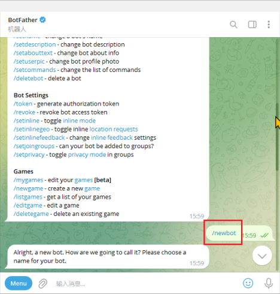
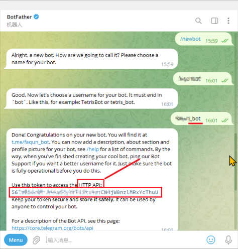
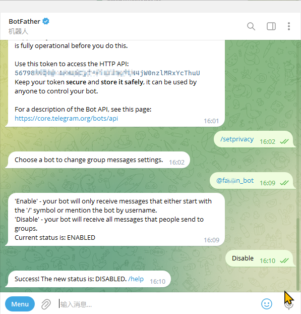
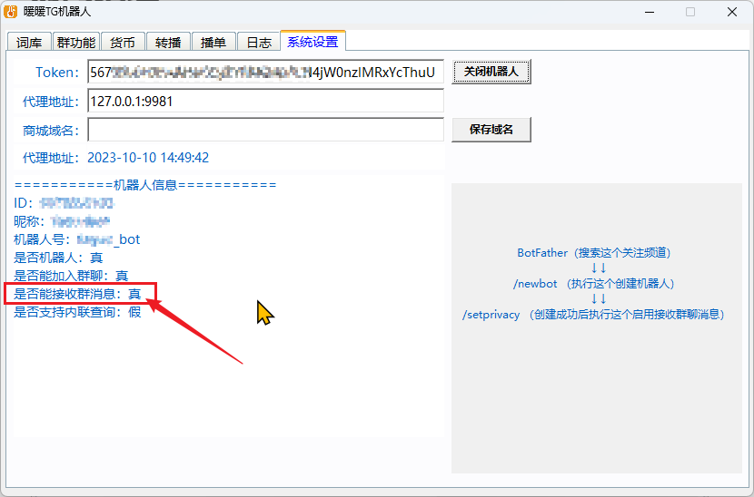

## 1、创建

TG中搜索，BotFather，这个父机器人对话，点击对话框的开启，输入 `/newbot`
```
/newbot
```


## 2、命名

设置机器人名称（name）和用户名（username）


?> 这里注意，输入`/newbot`创建一个新的机器人后，会提示你输入一个名字`name`，这个name是没有要求的，比如【测试机器人】。但是输入完会再提示你输入一个用户名`username`，这个username需要以“bot”结尾，比如【测试机器人bot】



## 3、复制API

命名结束会获取一个HTTP API，复制下来一会要用。看上图

## 4、监听群

设置监听群消息权限

输入`/setprivacy`，然后输入@+机器人的`username`，比如@测试机器人bot，一定要@，且是`username`
```
/setprivacy
```
最后输入`Disable`
```
Disable
```
最后提示`Success! The new status is: DISABLED`. 即表明创建成功。


!> 注意：每多开一个机器人，都需要对这个机器人做群监听授权，不做授权，下面的显示就是`假`，群内消息无法收到


