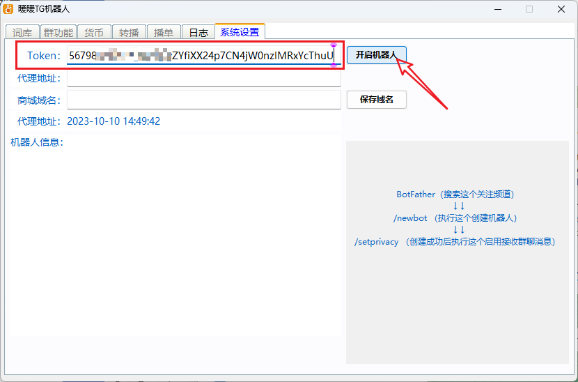
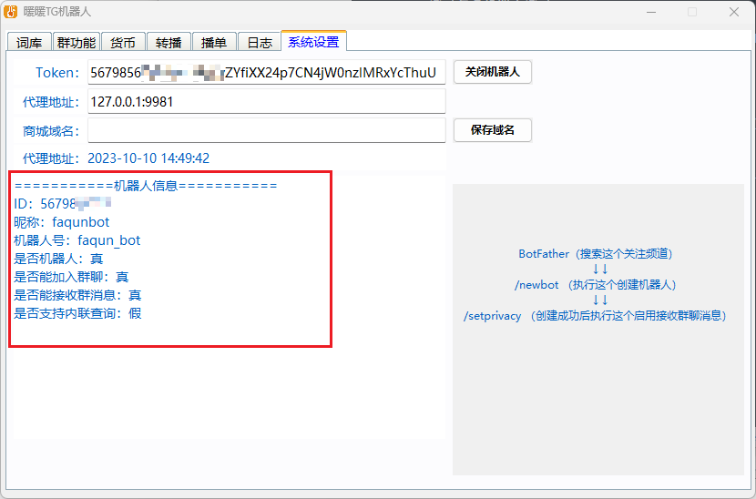
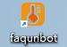
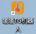

## 下载程序

## 注册账号

## 登录与多机器人登录
### 01-登录

登录后，打开软件设置，输入`Token`，就是机器人的HTTP API,然后点击`开启机器人`

开启成功后，有机器人信息显示

### 02-多机器人
此时，桌面会生成一个此机器人独有的快捷方式

多开第二个机器人，就继续双击主快捷方式，填写好`Token`后点击`开启机器人`，桌面会继续生成新的快捷方式。